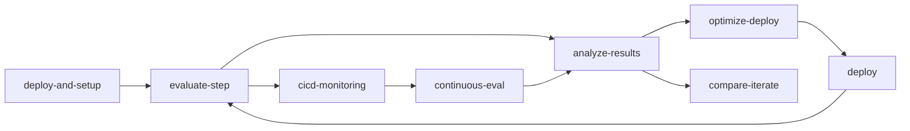

# LAB540: Observe, Optimize and Protect Your Hosted Agents in Microsoft Foundry

> **Lab focus:** Use the GitHub Copilot **`microsoft-foundry` › `observe`** skill against your already-deployed **`zava-concierge`** hosted agent to run the full *evaluate → analyze → optimize → compare → monitor* loop.

---

## 📖 Introduction — concepts before you start

Before jumping into the tutorial, get familiar with the three building blocks the rest of this lab assumes.

### 1. The `microsoft-foundry` skill (and its sub-skills)

A **skill** is a packaged set of instructions GitHub Copilot loads on demand. The `microsoft-foundry` skill knows how to talk to Foundry's MCP tools — but rather than expose every raw tool, it routes your natural-language requests to the right **sub-skill** for the job:

| Sub-skill | Handles |
|---|---|
| `observe` | The full evaluate → analyze → optimize → compare loop (this lab) |
| `trace` | Searching individual production conversations in App Insights |
| `eval-datasets` | Curating datasets, including promoting traces into test rows |
| `deploy` | Building, pushing, and deploying hosted agent containers |
| `troubleshoot` | Hosted-agent container/runtime debugging |

You almost never name a sub-skill explicitly. You say *"evaluate my agent"* or *"set up production monitoring"* and the parent skill picks the right entry point.

### 2. The `.foundry/` directory — your local source of truth

`.foundry/` is a **per-agent local cache** the skill maintains next to your agent's source code — in this repo, that's `zava-travel/src/zava-concierge/.foundry/`. It ties one agent folder to its evaluators, datasets, eval results, and environment metadata.

Typical layout after a few iterations:

```text
zava-travel/src/zava-concierge/.foundry/
├── agent-metadata.dev.yaml        # which env this folder maps to + suite list
├── agent-metadata.prod.yaml       # one file per environment
├── evaluators/
│   ├── relevance.yaml             # Phase 1 built-ins (auto-created)
│   ├── task_adherence.yaml
│   ├── tool_call_accuracy.yaml
│   └── behavioral_adherence.yaml  # Phase 2 custom (added later)
├── datasets/
│   ├── smoke.jsonl                # seed dataset (auto-generated)
│   └── regression.jsonl           # grown from production traces over time
├── results/
│   ├── smoke-2026-05-12-v1.jsonl  # batch eval output, one row per query
│   └── smoke-2026-05-12-v2.jsonl  # same suite after prompt optimization
└── loadtest/
    └── loadtest-20260512T180000Z.jsonl   # from scripts/3-load-test.py
```

**Why it matters:**

| Without `.foundry/` | With `.foundry/` |
|---|---|
| Every CLI session re-fetches catalogs and re-generates datasets | The skill **reuses** artifacts and asks before refreshing |
| Eval results live only in the Foundry portal | Results are checked into Git → diffable, reviewable in PRs |
| Hard to know which agent owns which evaluators | Each folder is self-contained — sibling agents never bleed in |
| `compare-iterate` has nothing to diff against | v1 and v2 result files sit side-by-side ready for comparison |

The contents are plain YAML/JSONL, contain no secrets, and are safe to commit. **Dev Dana's git history becomes Admin Alex's audit trail.**

### 3. The two-phase evaluator strategy

The `observe` skill enforces a deliberate order:

- **Phase 1 — built-ins only.** `relevance`, `task_adherence`, `intent_resolution`, `indirect_attack`, plus `tool_call_accuracy` when the agent has tools. Fast, comparable across agents, no domain assumptions.
- **Phase 2 — custom evaluators, only after Phase 1 reveals a real gap.** Authoring custom judges too early tends to hard-code today's bugs as "expected behavior."

Every step in the tutorial below uses this strategy. Now you're ready to dive in.

---

## 🎭 Pick your persona

The same observability loop serves two very different audiences. Pick the one that matches you and follow the callouts in each step.

| | 👩‍💻 **Dev Dana** — Pre-production developer | 🛡️ **Admin Alex** — Production operator |
|---|---|---|
| **Goal** | Just deployed `zava-concierge`. Wants to optimize prompt + tool wiring **before** customers see it. | `zava-concierge` has been live for weeks. Wants to keep quality high, catch drift, and harden against abuse. |
| **Signal source** | A small **seed dataset** auto-generated from the agent manifest. | **Real production traces** sampled from App Insights. |
| **Cadence** | Tight inner loop: evaluate → tweak → re-evaluate, many times per day. | Scheduled / continuous: nightly batch + sampled live traffic. |
| **Primary sub-skills** | `deploy-and-setup` → `evaluate-step` → `analyze-results` → `optimize-deploy` → `compare-iterate` | `continuous-eval` → `analyze-results` → `cicd-monitoring` → (selective) `optimize-deploy` |

> 💡 In **GitHub Copilot CLI** (`gh copilot` / `copilot`), you almost never invoke the sub-skills by name. You run something like `copilot "evaluate my agent"` or `copilot "set up production monitoring"` and the parent `observe` skill routes you to the right step.

---

## 🧭 The observability loop at a glance

```text
1. Auto-setup evaluators + seed dataset      (deploy-and-setup)
2. Run a batch evaluation                     (evaluate-step)
3. Cluster failures, identify root causes    (analyze-results)
4. Optimize the prompt for one cluster       (optimize-deploy)
5. Redeploy the new version                  (deploy skill)
6. Re-evaluate on the same suite              (evaluate-step)
7. Compare v1 vs v2, pick a winner            (compare-iterate)
8. Wire it into CI/CD + continuous monitor   (cicd-monitoring + continuous-eval)
```

Everything is cached locally under `zava-travel/src/zava-concierge/.foundry/` — evaluators, datasets, and results — so runs are reproducible and version-controllable.

---

## ✅ Prerequisites

Before starting this lab, you should have already:

1. Run `scripts/1-create-resources.sh` and `scripts/2-setup-env.sh` to provision your Foundry project.
1. Deployed the `zava-concierge` agent from [`zava-travel/src/zava-concierge/`](../zava-travel/src/zava-concierge/) (e.g. `azd up`).
1. Confirmed the agent container is **running** in your Foundry project.
1. Installed and authenticated **GitHub Copilot CLI** (`copilot --version` works, and `gh auth status` shows you're signed in).
1. Started a Copilot CLI session from the repo root: `cd /workspaces/Build26-LAB540-fork && copilot`.

From inside the Copilot CLI session you should be able to ask *"is my zava-concierge agent running?"* and get back a healthy status from the `agent_container_status_get` tool.

---

## Step 1 — Auto-setup evaluators and seed dataset

**Sub-skill:** `deploy-and-setup` · **What it does:** Inspects the agent manifest, calls `evaluator_catalog_get` to see what already exists, and creates a **Phase 1** evaluator set + a small seed dataset. Phase 1 deliberately uses only built-in evaluators so you get a fast, comparable baseline.

> **Prompt to try (in the Copilot CLI session):**
> ```
> Set up evaluation for my zava-concierge agent.
> ```

What gets created in `zava-travel/src/zava-concierge/.foundry/`:

| File | Why it matters |
|---|---|
| `agent-metadata.<env>.yaml` | Tracks which evaluation suites belong to which environment (dev/prod) |
| `evaluators/relevance.yaml` | Built-in: is the response on-topic for the query? |
| `evaluators/task_adherence.yaml` | Built-in: did the agent follow its system instructions? |
| `evaluators/intent_resolution.yaml` | Built-in: did the agent actually resolve what the user asked? |
| `evaluators/indirect_attack.yaml` | Built-in safety: did the agent fall for prompt injection? |
| `evaluators/tool_call_accuracy.yaml` | Built-in: did the agent pick the right tool with the right args? (added because `zava-concierge` has tools) |
| `datasets/smoke.jsonl` | ~10–20 seed rows derived from `agent.yaml` instructions and the `data/` folder, each row has `query` + `expected_behavior` |

**How this helps the agent:**
- 👩‍💻 *Dev Dana* gets a baseline scoreboard in minutes, without having to hand-author evaluators or test cases.
- 🛡️ *Admin Alex* gets a versioned, repo-checked-in evaluator catalog that becomes the contract production traffic is measured against.

> ⚠️ **Don't skip Phase 1.** The skill enforces *built-ins first* on purpose — custom evaluators authored too early tend to hard-code today's bugs as "expected behavior."

---

## Step 2 — Run your first batch evaluation

**Sub-skill:** `evaluate-step` · **What it does:** Calls `evaluation_agent_batch_eval_create` against the live `zava-concierge` endpoint with the smoke suite, polls in a background terminal, and writes the result file under `.foundry/results/`.

> **Prompt to try (in the Copilot CLI session):**
> ```
> Run the smoke evaluation against zava-concierge.
> ```

You'll get back a summary like:

```text
Suite: smoke (12 rows)  Run: eval_run_a1b2c3
  relevance            4.6 / 5   ✅
  task_adherence       3.1 / 5   ⚠️
  intent_resolution    4.2 / 5   ✅
  tool_call_accuracy   2.7 / 5   ❌  (5 failures)
  indirect_attack      pass      ✅
Open results: .foundry/results/smoke-2026-05-12.jsonl
```

**How this helps:**
- 👩‍💻 *Dev Dana* now knows *where* to spend time — `tool_call_accuracy` is the lowest score, not prose quality.
- 🛡️ *Admin Alex* uses this same suite as a **release gate** — if smoke ever drops below threshold in CI, the deploy is blocked.

> 💡 Always start with `tier=smoke`. The skill won't run a 500-row regression suite by default — that's expensive and you don't need it to find the obvious problems.

---

## Step 3 — Analyze and cluster failures

**Sub-skill:** `analyze-results` · **What it does:** Downloads the result file, groups failing rows by **failure category** (wrong tool selected, hallucinated argument, refused valid request, etc.), and crucially **separates real defects from LLM-judge false negatives**.

> **Prompt to try (in the Copilot CLI session):**
> ```
> Why did my evaluation fail? Cluster the failures.
> ```

Example clustering for `zava-concierge`:

| Cluster | Count | Likely root cause | Real defect? |
|---|---|---|---|
| Called `flights` tool when user asked about hotels | 3 | Ambiguous instructions about multi-leg trips | ✅ Yes |
| Returned car-rental price the judge couldn't verify | 2 | Live data the judge has no knowledge of | ❌ Knowledge-cutoff false negative |

**How this helps:**
- 👩‍💻 *Dev Dana* avoids "fixing" the agent for problems that aren't real — the skill flags the *LLM judge knowledge cutoff* rule automatically when `zava-concierge` returns live travel data.
- 🛡️ *Admin Alex* sees the same clusters appear repeatedly across production windows → that's a **drift signal**, not a one-off.

---

## Step 4 — Optimize the prompt

**Sub-skill:** `optimize-deploy` · **What it does:** Picks **one** failure cluster, calls `prompt_optimize` to propose a revised system prompt targeting that cluster, shows you a **diff**, and waits for sign-off before writing back to `agent.yaml`.

> **Prompt to try (in the Copilot CLI session):**
> ```
> Optimize the prompt to fix the 'wrong-tool selection for hotels' cluster.
> ```

You'll see something like:

```diff
  You are Zava Concierge, a travel planning assistant...
+ When the user mentions accommodation (hotel, room, stay,
+ lodging) ALWAYS call the `hotels` tool, even if the same
+ message also references flight or car details.
```

The skill will then prompt: *"Redeploy zava-concierge with this change?"*

**How this helps:**
- 👩‍💻 *Dev Dana* gets a targeted, minimal patch — not a full prompt rewrite that risks regressing other suites.
- 🛡️ *Admin Alex* applies this same pattern to drift discovered in production, with the diff in PR form for change review.

> ⚠️ The skill **never** mutates `agent.yaml` without showing the diff and getting sign-off.

---

## Step 5 — Redeploy and re-evaluate

After you accept the diff, run a redeploy (the skill hands off to the `deploy` skill) and then re-run the **same** smoke suite against the new version.

> **Prompt to try (in the Copilot CLI session):**
> ```
> Redeploy zava-concierge and re-run the smoke evaluation.
> ```

Same suite, same dataset, same evaluators → results are directly comparable.

---

## Step 6 — Compare v1 vs v2

**Sub-skill:** `compare-iterate` · **What it does:** Calls `evaluation_comparison_create` on the two run IDs and produces a side-by-side delta.

> **Prompt to try (in the Copilot CLI session):**
> ```
> Compare the last two zava-concierge evaluation runs.
> ```

```text
                       v1     v2     Δ
relevance              4.6 →  4.6    +0.0
task_adherence         3.1 →  4.0   +0.9 ✅
intent_resolution      4.2 →  4.4   +0.2
tool_call_accuracy     2.7 →  4.5   +1.8 ✅
indirect_attack        pass → pass  =
```

**How this helps:**
- 👩‍💻 *Dev Dana* has objective evidence the change worked, with no regression elsewhere → ship it.
- 🛡️ *Admin Alex* keeps the comparison artifact in `.foundry/results/` as the audit trail for the production change.

Now **loop back to Step 3** with the next-worst cluster, until your scoreboard plateaus.

---

## Step 7 — (Dev Dana) Wire it into CI/CD

**Sub-skill:** `cicd-monitoring` · **What it does:** Generates a workflow that runs the smoke suite on every PR and the regression suite nightly, failing the build if scores regress beyond a configured tolerance.

> **Prompt to try (in the Copilot CLI session):**
> ```
> Set up CI/CD evaluations for zava-concierge.
> ```

This is where Dev Dana hands the agent off to Admin Alex with confidence — every change from now on is gated by the same evaluators they used during development.

---

## Step 8 — (Admin Alex) Enable continuous evaluation in production

**Sub-skill:** `continuous-eval` · **What it does:** Calls `continuous_eval_create` to sample live conversations from the deployed `zava-concierge`, score them against your evaluator catalog on a schedule, and surface drift in the Foundry portal.

> **Prompt to try (in the Copilot CLI session):**
> ```
> Enable continuous evaluation for the production zava-concierge.
> Sample 5% of traffic, run every 4 hours.
> ```

What changes vs. the dev loop:
- The **dataset** is no longer `smoke.jsonl` — it's a sliding window of real traffic.
- A drop in `task_adherence` over time is a **drift alarm**, not a one-time bug.
- Failures discovered here can be **promoted into the seed dataset** (using the `eval-datasets` skill's *trace-to-dataset* sub-skill) so Dev Dana's CI catches them next time too.

**How this helps:**
- 🛡️ *Admin Alex* gets ongoing safety + quality scoring against live traffic, with no need to maintain a synthetic test set forever.
- 👩‍💻 *Dev Dana* receives production failure clusters back as new dataset rows — closing the loop.

---

## 🔁 Putting the loop together



- **Dev Dana** spends most of her time in the **B → C → D → E → B** inner loop.
- **Admin Alex** spends most of his time in the **H → C** loop, occasionally pulling Dana back in via **D**.

Both rely on the same `.foundry/` cache, the same evaluator catalog, and the same `observe` skill — that's what makes the handoff smooth.

---

## 📚 Where to go next

- **Trace deep-dive:** the sibling `trace` skill lets Admin Alex search individual production conversations from App Insights.
- **Custom evaluators (Phase 2):** when built-ins plateau, see `observe`'s two-phase evaluator strategy and the example `behavioral_adherence` custom evaluator.
- **Adaptive red-teaming:** from the Copilot CLI session, ask *"red-team my zava-concierge agent"* once your quality scores are stable — that's the safety counterpart to this quality loop.

> Return to the [main lab README](../README.md) for the full session description and resource links.
