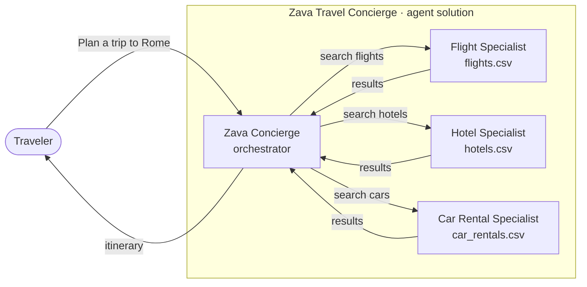
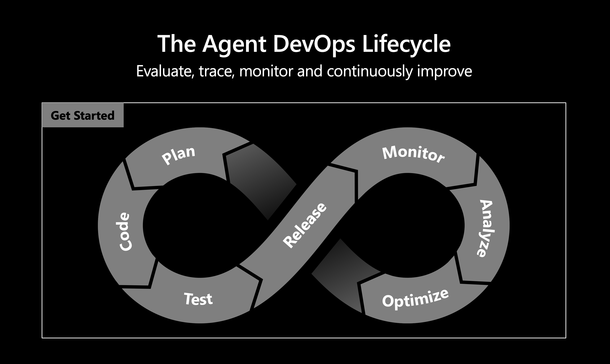

# Get Started

Welcome to the **LAB540** (self-guided) workshop guide! 

You're about to take the **Zava Travel
Concierge** — a multi-agent travel planner running as a **Hosted Agent** on
**Microsoft Foundry** — and make it observable, measurable, and better.

> [!NOTE]
> **Meet the agent.** The Zava Travel Concierge coordinates three specialist
> sub-agents — **flights**, **hotels**, and **car rentals** — each grounded in
> its own data. The Zava Travel Concierge never answers from its own knowledge;
> it delegates to the specialists and composes the itinerary.

## Setting The Stage

Shipping an agent is the **beginning** of your AI solution development story - not the end.

A multi-agent system like the
Zava Travel Concierge is non-deterministic — the same prompt can take different paths,
call different tools, and produce different answers. And the ground keeps
shifting: **models evolve** (new versions are released, deprecated, or change
behavior), and **production traffic uncovers edge cases** you never anticipated —
unusual requests, prompts that probe for unsafe answers, or gaps in your
grounding data. You can't improve what you can't see, so production agents need a
continuous loop of **observe → measure → improve**.

| Keyword | Description |
|---------|-------------|
| **Observability** | Your ability to understand what the agent is *actually* doing in production: which sub-agents it called, what tools ran, how long each step took, what it cost, and whether the final answer was correct, grounded, and safe. Foundry gives you this through **metrics, traces, and evaluations**. |
| **Continuous optimization** | The discipline of acting on what you observe. Think of it as **hill climbing**: measure a baseline, change *one* thing (an instruction, a tool, a model), re-measure, and keep the change only if the score went up. Repeat, and the agent steadily climbs toward better quality, lower cost, and stronger safety — without ever stepping backward. |
| **The Agent DevOps Lifecycle** | The loop (above) that makes this repeatable: you **Plan** and **Code** a change, **Test** and **Release** it, then **Monitor**, **Analyze**, and **Optimize** what you learn in production — which feeds the next change. The right side of the loop (Monitor → Analyze → Optimize) is exactly the "observe and improve" cycle this lab focuses on. |

## What you'll do

The lab first walks you through the **left side** of the loop with a simple
exploration of the Hosted Agent in the playground — to give you a sense for
Foundry's built-in observability and how the Hosted Agent behaves. Then it spends
the bulk of its time in the **right half** of the loop, turning those
observations into a measurable improvement across three short stages:

| Stage | Description |
|-------|-------------|
| **Setup** | Fork the repo, launch a Codespace, and **Release** the Zava Travel Concierge to your own Azure subscription with `azd up`. This gives you a live agent to observe. |
| **Observe** | **Monitor** and **Analyze** the Hosted Agent in the playground using Foundry's built-in observability (metrics, traces, evaluations) to find where it's slow, costly, or wrong. |
| **Optimize** | Close the loop: **Optimize** the agent by running the eval → fix → redeploy cycle with Foundry Skills and GitHub Copilot, then confirm the score climbed. |

> [!NOTE]
> **Level:** 200–300 &nbsp;•&nbsp; **Duration:** 75–90 minutes

---

🏠 [Contents](./README.md) &nbsp;•&nbsp; [Next: Prerequisites →](./01-setup-01.md)
