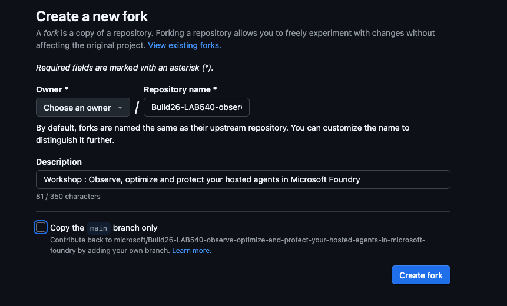

# Fork the Repo

Fork the workshop repository to your own GitHub account so you can run a
Codespace and (optionally) keep your changes.

1. [Click here](https://github.com/microsoft/Build26-LAB540-observe-optimize-and-protect-your-hosted-agents-in-microsoft-foundry/fork) to go directly to the "Create Fork" page
1. Uncheck the `Copy the main branch only` option - to get all branches
1. Select your profile from the `Choose an owner` dropdown.
1. Click `Create fork` to confirm and wait for process to complete.
1. You should now be taken to the page with your new fork.

> [!TIP]
> Forking (rather than cloning directly) lets you push commits to your own copy
> if you want to keep the optimized agent afterwards.

---

> ✅ **Success:** you have your own fork of the workshop repository.

---

[← Prev: Prerequisites](./01-setup-01.md) &nbsp;•&nbsp; 🏠 [Contents](./README.md) &nbsp;•&nbsp; [Next: Launch Codespace →](./01-setup-03.md)
