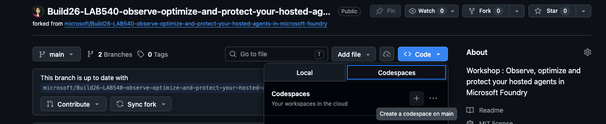

# Launch Codespace

Start a **GitHub Codespace** on your fork — a cloud dev environment with all the
tools you need (`az`, `azd`, `python`, Docker) already installed.

1. On your fork, select the green **Code** button, then the **Codespaces** tab.
2. Select **Create codespace on main**.
3. Wait for the Codespace to build and for VS Code to fully load in the browser.

> [!NOTE]
> The Codespace may take a while to finish loading **even if the terminal looks
> active**. Before moving on, confirm the **extensions have loaded** and the
> **library dependencies have finished installing** (watch for the post-create
> setup to complete). Running commands too early can fail or behave unexpectedly.



4. Open a terminal (**Terminal → New Terminal**) and confirm the core CLIs are
   present:

   ```bash
   az version
   ```

   ```bash
   azd version
   ```

   ```bash
   python --version
   ```

> [!NOTE]
> The Codespace can take a few minutes to build the first time. Everything you
> do from here — deploy, observe, optimize — happens inside it.

---

> ✅ **Success:** your Codespace is open with `az`, `azd`, and `python` ready.

---

[← Prev: Fork the Repo](./01-setup-02.md) &nbsp;•&nbsp; 🏠 [Contents](./README.md) &nbsp;•&nbsp; [Next: Sign in to Azure →](./01-setup-04.md)
