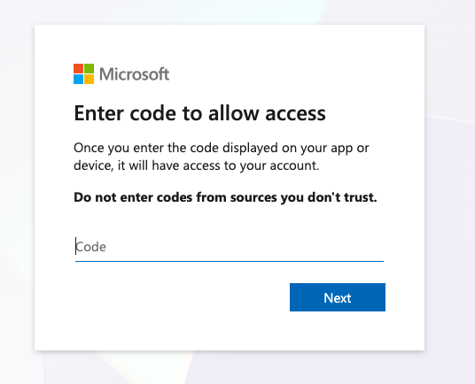

# Sign in to Azure

`azd up` deploys into your Azure subscription, so sign in with both the Azure
CLI (`az`) and the Azure Developer CLI (`azd`). Use **device code** sign-in
inside the Codespace.

## Sign in with `az`


1. In the terminal, run:

   ```bash
   az login --use-device-code
   ```
1. Open the verification URL - you should see this:

   

1. Enter the code shown, and sign in with **your
   Azure account**.
1. Complete workflow, then close that window when prompted, and return to Codespaces
1. In the terminal, select the subscription you want to deploy into.

## Sign in with `azd`

1. In the terminal, run:

   ```bash
   azd auth login --use-device-code
   ```

2. Complete th device-code sign-in flow just as before.

<!-- TODO screenshot: device code sign-in prompt -->

---

> ✅ **Success:** you're signed in to Azure with both `az` and `azd`.

---

[← Prev: Launch Codespace](./01-setup-03.md) &nbsp;•&nbsp; 🏠 [Contents](./README.md) &nbsp;•&nbsp; [Next: Deploy Infrastructure →](./01-setup-05.md)
