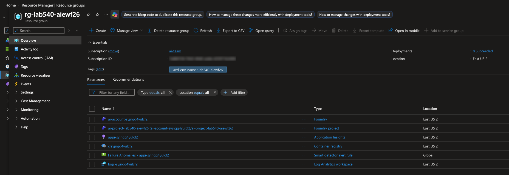

e to# Azure Portal

Open the Azure portal in a browser tab and confirm your resources were created.

1. In a new browser tab, navigate to <https://portal.azure.com> and sign in with
   **your Azure account**.
2. Select **Resource groups** and find the resource group `azd up` created (it
   uses the environment name you chose, e.g. `rg-lab540`).
3. Confirm the group contains the **Foundry project**, **model deployment**,
   **container registry**, and **Application Insights**.

> [!NOTE]
> Everything here was provisioned by `azd up` from the Bicep in
> [`zava/infra/`](../../zava/infra/) — the Foundry project, model deployment,
> container registry, and Application Insights.

> [!TIP]
> Prefer dark mode? Click the **gear** icon in the portal toolbar, open
> **Appearance**, and switch the theme to **dark**.

---

> ✅ **Success:** the Azure portal shows your deployed resource group.

---

[← Prev: Deploy Infrastructure](./01-setup-05.md) &nbsp;•&nbsp; 🏠 [Contents](./README.md) &nbsp;•&nbsp; [Next: Foundry Portal →](./01-setup-07.md)
