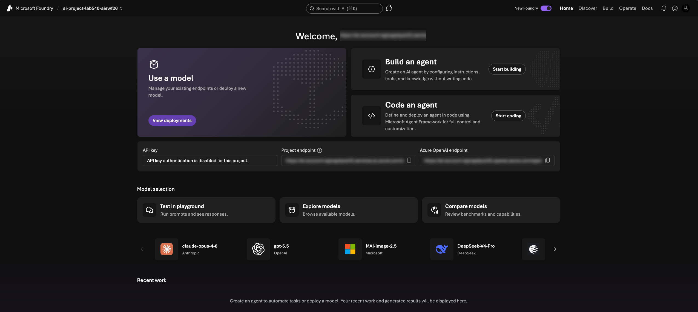

# Foundry Portal

Open the **Microsoft Foundry Portal**, where your hosted agent is deployed.

1. In a new browser tab, navigate to <https://ai.azure.com> and sign in with
   **your Azure account**.
2. Toggle on the **New Foundry** switch if it isn't already active.
3. Select your project (the one `azd up` created), then choose **Let's go**.
4. You should see a landing page like this:

> [!NOTE]
> A welcome tour or "create an agent" dialog may appear. Close it — your agent
> already exists and you'll open it in the next stage.

Let's take a minute to make sure the required model and agent were pre-deployed.

1. Click on the `Build` tab in the navigation bar (top right)
1. Then select the `Agents` option in the sidebar (left)
1. You should see a single `zava-concierge` agent (type: hosted)
1. Next, select the `Models` option in the sidebar (left)
1. You should see a single `gpt-5.4-mini` model deployed 

---

> ✅ **Success:** the Foundry Portal is open, with model & agent deployed
>
> 🏁 **Stage 1 complete.** Your infrastructure is deployed, the hosted agent is
> live, and both the Azure and Foundry portals are open. Next, you'll explore
> the agent and Foundry's built-in observability.

---

[← Prev: Azure Portal](./01-setup-06.md) &nbsp;•&nbsp; 🏠 [Contents](./README.md) &nbsp;•&nbsp; [Next: Open Playground →](./02-observe-01.md)
