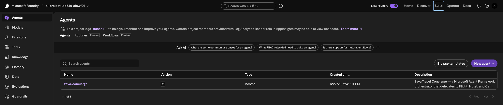
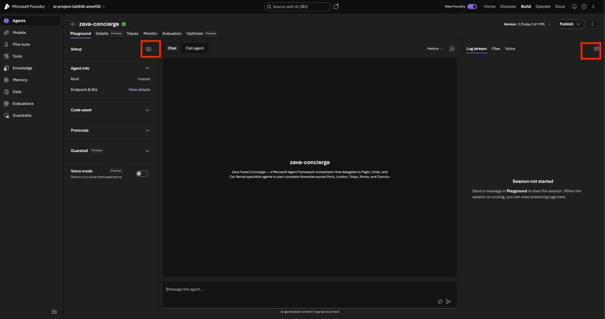

# Open Playground

Switch to the **Foundry Portal** tab and meet your hosted agent.

1. In the Foundry Portal, open **Agents** from the left navigation.

   
2. Select the **Zava Travel Concierge** agent to open it.
3. You should see the Agent Playground view with three panels as shown below. You can click on the red-highlighted toggles at any point to hide (or reveal) the side panels. _For now, click the left toggle to close the details panel, but leave the right logs panel open_.

   

> [!NOTE]
> The **playground** is a live chat against your deployed hosted agent. Every
> message you send runs through the real concierge and its specialist sub-agents
> — and is captured for observability.

---

> ✅ **Success:** the Zava Travel Concierge playground is open and ready.

---

[← Prev: Foundry Portal](./01-setup-07.md) &nbsp;•&nbsp; 🏠 [Contents](./README.md) &nbsp;•&nbsp; [Next: Set Up Metrics →](./02-observe-02.md)
