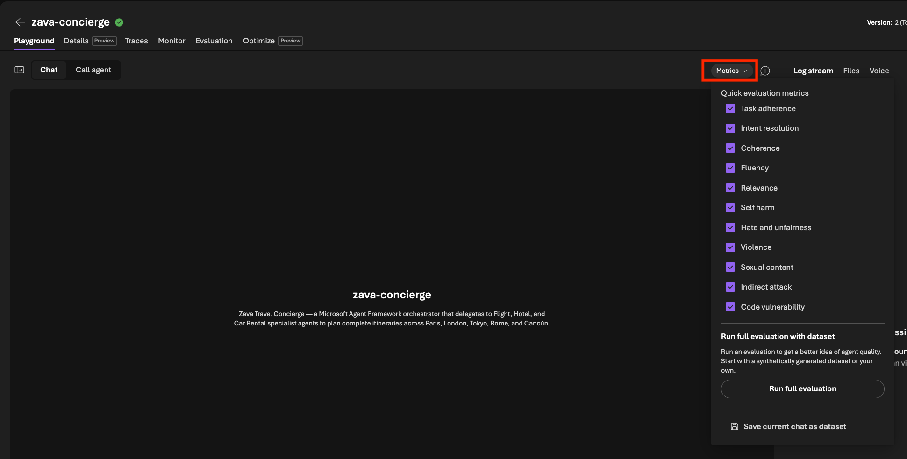

# Set Up Metrics

Before you send a prompt, turn on the **evaluators** so Foundry scores each
response as it happens.

1. In the playground, click the **metrics** button to expose selections
1. Select all metrics as shown in the image below. Click to close.
1. The playground will now auto-evaluate these for agent responses.

> [!NOTE]
> **Evaluators** are automatic graders. Foundry's built-in evaluators score each
> response on dimensions like **task completion**, **coherence**, and safety
> (such as **indirect attack** resistance) — no test code required.

---

> ✅ **Success:** evaluators are on and the playground is ready for your prompt.

---

[← Prev: Open Playground](./02-observe-01.md) &nbsp;•&nbsp; 🏠 [Contents](./README.md) &nbsp;•&nbsp; [Next: Run Prompt 1 →](./02-observe-03.md)
