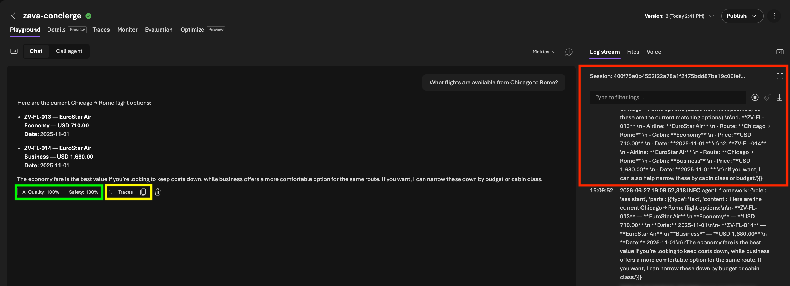
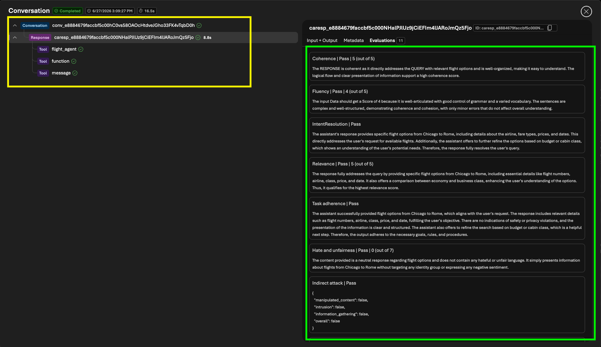
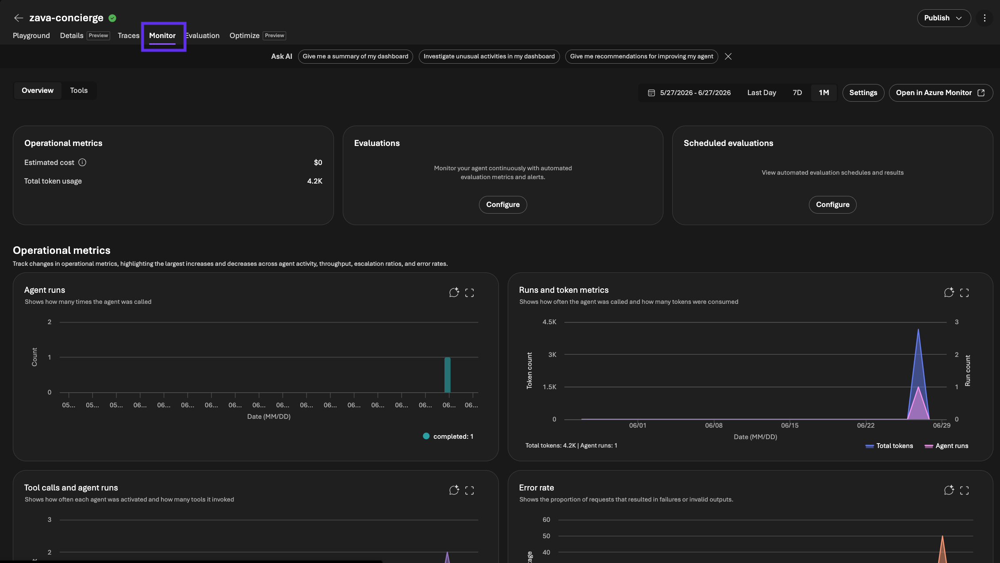
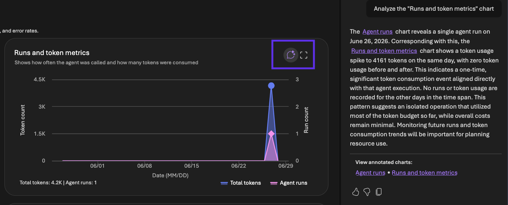

# Run Prompt 1

Send a simple, single-specialist request and watch the metrics light up.

1. In the playground, send this prompt:

   ```text
   What flights are available from Chicago to Rome?
   ```

2. Wait for the concierge to reply - this takes a few seconds.
3. You should now see something like this:

   

4. Note the highlighted elements on the screen
   - You see the default response (returns relevant flights)
   - The see the log stream for agent actions (red box)
   - You see the auto-evaluated quality & safety metrics (green box)
   - You see a link to agent traces for this request (yellow box)

5. Does the response match the request? (_You can verify that the flights shown match the data under `data/csv/flights.csv`_)

6. Click on the green `AI Quality` button. You will see something like this:
   
   - The green box shows the actual evaluation results for the quality metrics we selected, based on _this response_.
   - The yellow box provides the trace view for this interaction, giving us insights into the _latency, token costs, and events or calls that happened_ before response was returned for the request.

   > [!NOTE]
   > **Evaluators** are automatic graders. Foundry scores each response live on
   > quality and safety dimensions — no test code required — so you can see whether
   > an answer is good the moment it's produced.

   > [!NOTE]
   > A **trace** is the step-by-step record of how the agent produced its answer —
   > including the call it made to the **Flight Specialist**. The evaluator scores
   > hang right off the trace, so quality and execution live in one place.


7. Close the trace window, then click on the `Monitor` tab in the navigation menu provided in the Playground (see purple box below). You should get this view.
   
   - This is the _Monitoring_ tab for your deployed agent. It is a single pane of glass for viewing agent metrics in production across its lifetime.
   - See how many times the agent was called, how many tokens it has consumed, how many tools it invoked, and how many times it failed.
   - Click on the _agent helper_ icon within any chart (shown by the purple box below) to get an AI-generated analysis of that data that can provide insights into agent performance based on that metric.

   

   > [!NOTE]
   > The **Monitor** tab is your single pane of glass in production. It aggregates
   > calls, token usage, tool invocations, and failures across the agent's
   > lifetime, with AI-generated analysis to surface insights.

You've now seen the built-in observability features for hosted agents in
Microsoft Foundry — live evaluations, request traces, and production monitoring.

---

> ✅ **Success:** a response was scored live and you opened its trace.

---

[← Prev: Set Up Metrics](./02-observe-02.md) &nbsp;•&nbsp; 🏠 [Contents](./README.md) &nbsp;•&nbsp; [Next: Run Prompt 2 →](./02-observe-04.md)
