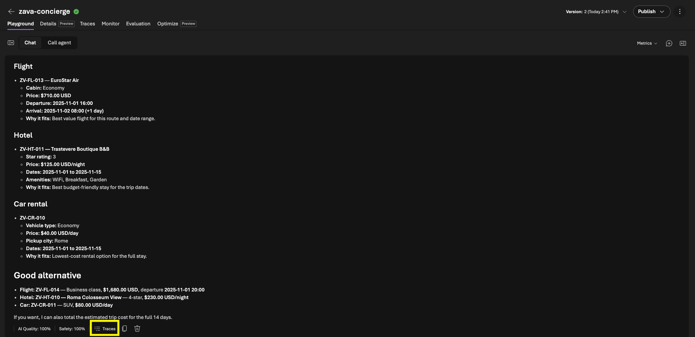
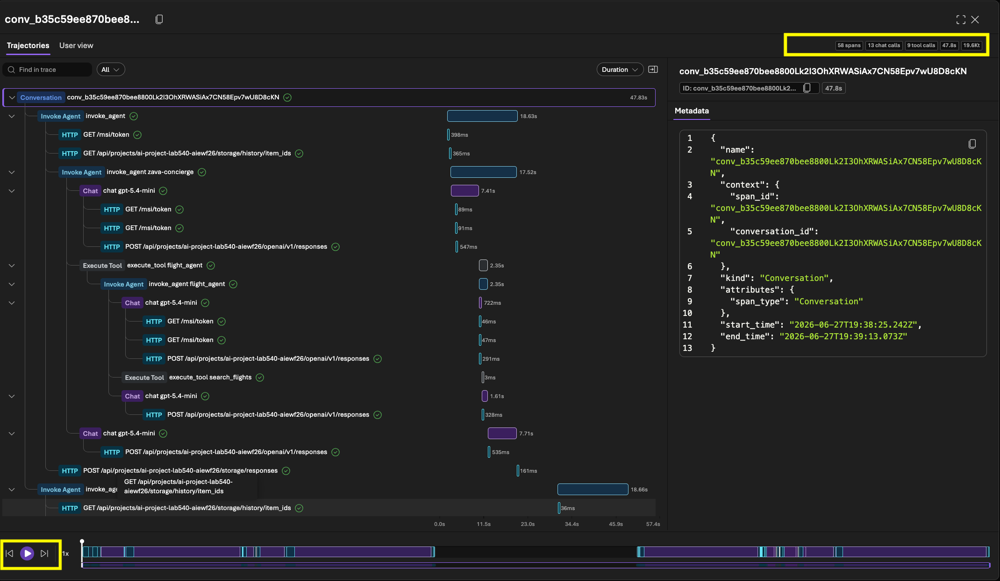
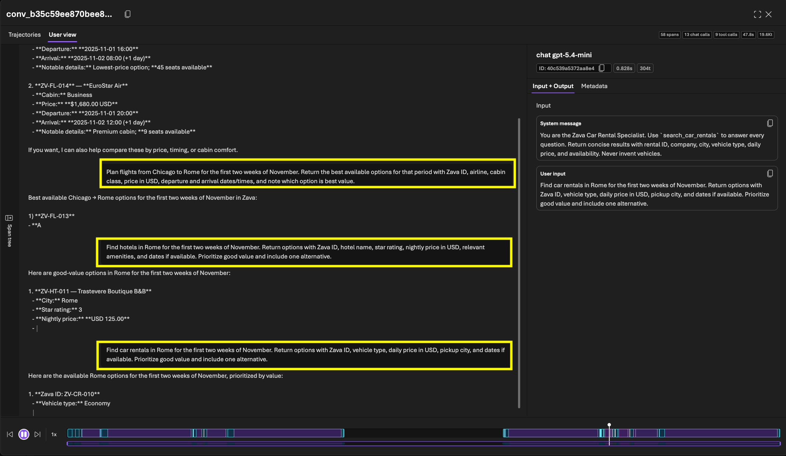

# Run Prompt 2

Now send a multi-part request that makes the concierge coordinate all three
specialists.

1. In the playground, send this prompt:

   ```text
   Plan a trip from Chicago to Rome for the first two weeks of November. I need flights, a hotel, and a car rental.
   ```

2. Wait for the concierge to compose the full itinerary. The response now includes flight, hotel, and car results — so all three specialists were called by the orchestrator before composing the final answer. _But how did that happen under the hood?_ Trace views show you.
   

3. Click the `Traces` button above to open the _Trajectory_ view, which visualizes this turn's **trace** as a **conversation** — the concierge delegating specialized requests to the flight, hotel, and car-rental agents. Click **Play** to watch it unfold, and check the metrics (top-right) for total chat calls, tool calls, tokens, time, and **spans**.

   

4. Click the `User View` tab, then **Play**. This is a time-based replay of which requests went to each agent, when, and how the final response was composed — giving you an intuitive sense of per-agent latency. _Note the yellow boxes: each agent's requests and responses stream in parallel before being merged into one reply._

   

> [!NOTE]
> **Trajectory vs. User View.** Two complementary lenses on the same trace. The
> **Trajectory view** exposes the agent's internal orchestration — how the
> concierge decomposed and delegated the request — so you can pinpoint *which*
> agent or tool call went wrong. The **User View** replays the interaction on a
> timeline, showing *when* each request fired and how responses streamed back, so
> you can spot the step responsible for latency. Together they let you debug
> correctness and diagnose performance from a single captured trace — no
> re-running required.

---

> ✅ **Success:** you inspected a multi-agent conversation trace and replays.

---

[← Prev: Run Prompt 1](./02-observe-03.md) &nbsp;•&nbsp; 🏠 [Contents](./README.md) &nbsp;•&nbsp; [Next: Run Prompt 3 →](./02-observe-05.md)
