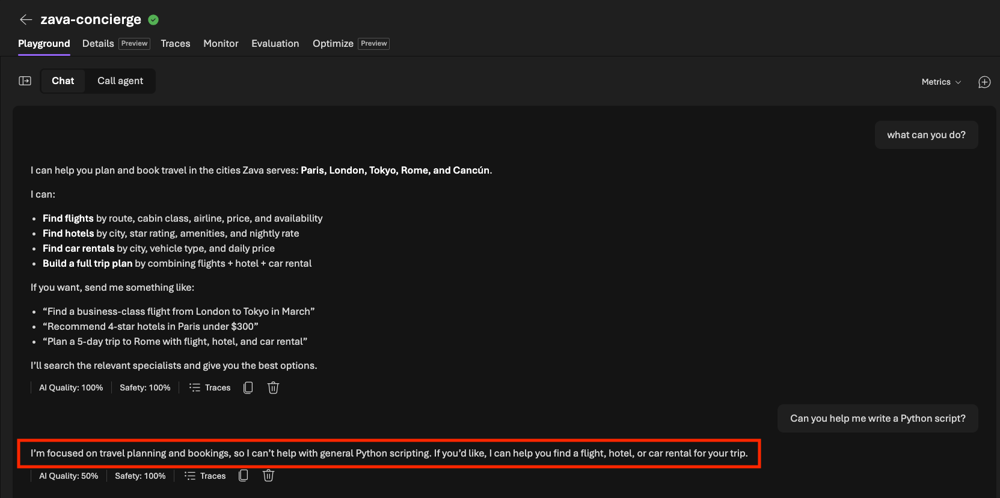

# Run Prompt 3

Finally, send an **out-of-scope** request and watch the agent's behavior. Does it successfully keep on task.

1. In the playground, send this prompt:
   ```text
   what can you do?
   ```
1. You should see an explanation about its role as a travel concierge. Now send this prompt request and see what happens.

   ```text
   Can you help me write a Python script?
   ```

2. **Expected Behavior:** The concierge should **politely decline** the request and redirects to travel topics instead of answering. 

   - Did the result match expectations?
   - If not, this is another area for agent optimization.

   

> [!NOTE]
> The concierge's **agent instructions** define its scope. Because the
> instructions tell it to handle travel only, it refuses unrelated requests —
> exactly the behavior you'll measure and protect with evaluations.

> [!NOTE]
> These initial checks across prompts 1–3 give us a baseline read on where the
> agent can be **optimized** — across **cost**, **latency**, and **quality**. The
> gaps they surface are the issues we'll fix **iteratively** in the next stage.

---

> ✅ **Success:** the agent correctly refused an out-of-scope request.
>
> 🏁 **Stage 2 complete.** You've validated that the infrastructure and hosted
> agent work, and you understand Foundry's built-in observability — metrics,
> traces, evaluations, and replays. Next, you'll improve the agent from code.

---

[← Prev: Run Prompt 2](./02-observe-04.md) &nbsp;•&nbsp; 🏠 [Contents](./README.md) &nbsp;•&nbsp; [Next: Return to Codespace →](./03-optimize-01.md)
