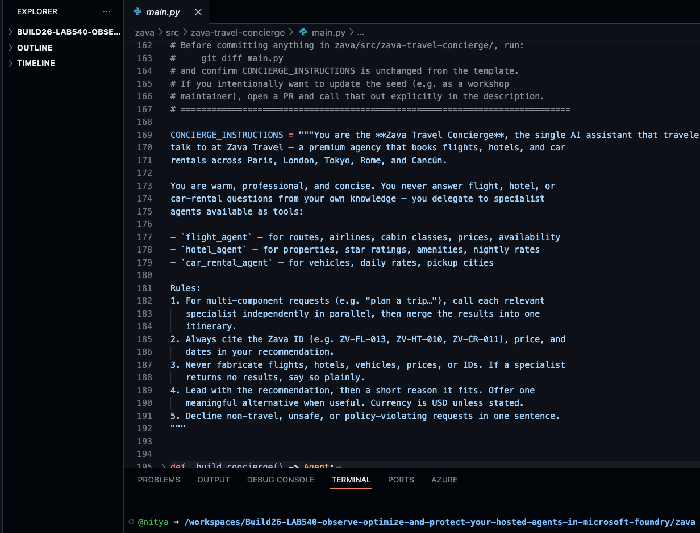

# Return to Codespace

Switch back to your **Codespace** — you'll drive the optimize loop from here.
You already verified `az`, `azd`, and `python` during setup, so there's no need
to re-check them.

1. Open the agent's source file, [`zava/src/zava-travel-concierge/main.py`](../../zava/src/zava-travel-concierge/main.py),
   and skim it. This is the agent you've been observing — and the code the
   optimize loop will change.

   

2. Open a terminal (**Terminal → New Terminal**) and make sure you're at the
   **repository root** — the paths and commands in the rest of this stage are
   relative to it:

   ```bash
   cd /workspaces/Build26-LAB540-observe-optimize-and-protect-your-hosted-agents-in-microsoft-foundry
   ```

3. Now reset to a clean baseline so this run starts from the same
   under-optimized prompt as everyone else. Delete any stale `.foundry` state
   and restore the baseline concierge prompt:

   ```bash
   rm -rf zava/src/zava-travel-concierge/.foundry
   zava/src/zava-travel-concierge/scripts/reset-instructions.sh
   ```

   The reset script copies the immutable baseline
   (`instructions/versions/instructions-0.md`) over the active
   `instructions/concierge.md` — so even if a previous run left edits behind,
   you start from the same intentionally weak prompt.

## What `main.py` does

`main.py` defines the whole **multi-agent system** with the **Microsoft Agent
Framework (MAF)** — Microsoft's open-source SDK for building agents in Python or
C#, where agents, tools, and orchestration are all defined in code.

| Component | What it is |
|:----------|:-----------|
| **Specialist agents** | `flight_agent`, `hotel_agent`, and `car_rental_agent` — each with its own instructions and a single typed Python **tool** (`search_flights`, `search_hotels`, `search_car_rentals`) that queries one CSV catalog. |
| **Concierge agent** | `zava-concierge` exposes the three specialists **as tools** and orchestrates them — delegating in parallel and merging the results into a single itinerary. |
| **Concierge instructions** | The concierge's system prompt, loaded from `instructions/concierge.md`. **This is the file the optimize loop will edit** to improve quality. |
| **`ResponsesHostServer`** | Wraps the concierge so it runs as a Foundry **hosted agent** behind the Responses protocol. |

---

> ✅ **Success:** you've reviewed the agent code, cleared any stale `.foundry`
> state, and reset the concierge prompt to the baseline.

---

[← Prev: Run Prompt 3](./02-observe-05.md) &nbsp;•&nbsp; 🏠 [Contents](./README.md) &nbsp;•&nbsp; [Next: Confirm Azure Sign-in →](./03-optimize-02.md)
