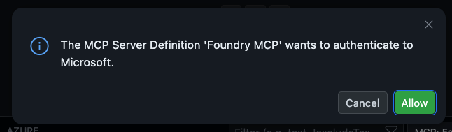
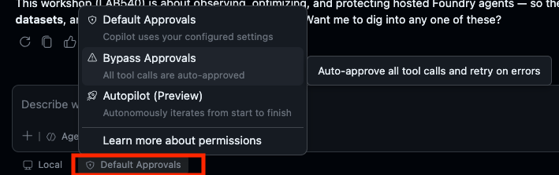

# Activate Copilot

You'll drive the optimize loop by talking to **GitHub Copilot**, which uses the
**Foundry MCP** and the `microsoft-foundry` skill to do the work.

1. Open **Copilot Chat** by clicking the chat icon (shown in the red box below)

   

2. Say hello to confirm it's responding — wait until it's ready:

   ```text
   Hello!
   ```

3. Make sure the **Foundry MCP server** is enabled (check the tools/MCP picker
   in Copilot Chat).

   When you say hello, the chat will prompt you to **activate the Foundry MCP
   server** — choose **Yes**. This starts an authentication flow; **sign in with
   the same account you used for Azure**. _If you miss this prompt, check troubleshooting guide below for a way to trigger this manually_.

   


4. Make sure the Copilot Chat is in _Agent_ mode. Set the chat **model** to **Claude Sonnet 4.6**.

> [!IMPORTANT]
> You may see Copilot try to enforce **Codestral** as the default model and show
> an error. Ignore it — **start a new chat session** and explicitly pick
> **Claude Sonnet 4.6** as the model.

5. **Speed things up.** Below the Copilot Chat input box, click the **Default
   Approvals** control and switch it to **Bypass Approvals**. The Observe skill
   runs many steps, and this lets Copilot run tools without asking you to confirm
   each one to make best use of limited lab time.



---

> ✅ **Success:** Copilot is in Agent mode, Foundry MCP on, model set, approvals bypassed.

---

[← Prev: Confirm Azure Sign-in](./03-optimize-02.md) &nbsp;•&nbsp; 🏠 [Contents](./README.md) &nbsp;•&nbsp; [Next: Meet the Skill →](./03-optimize-04.md)
