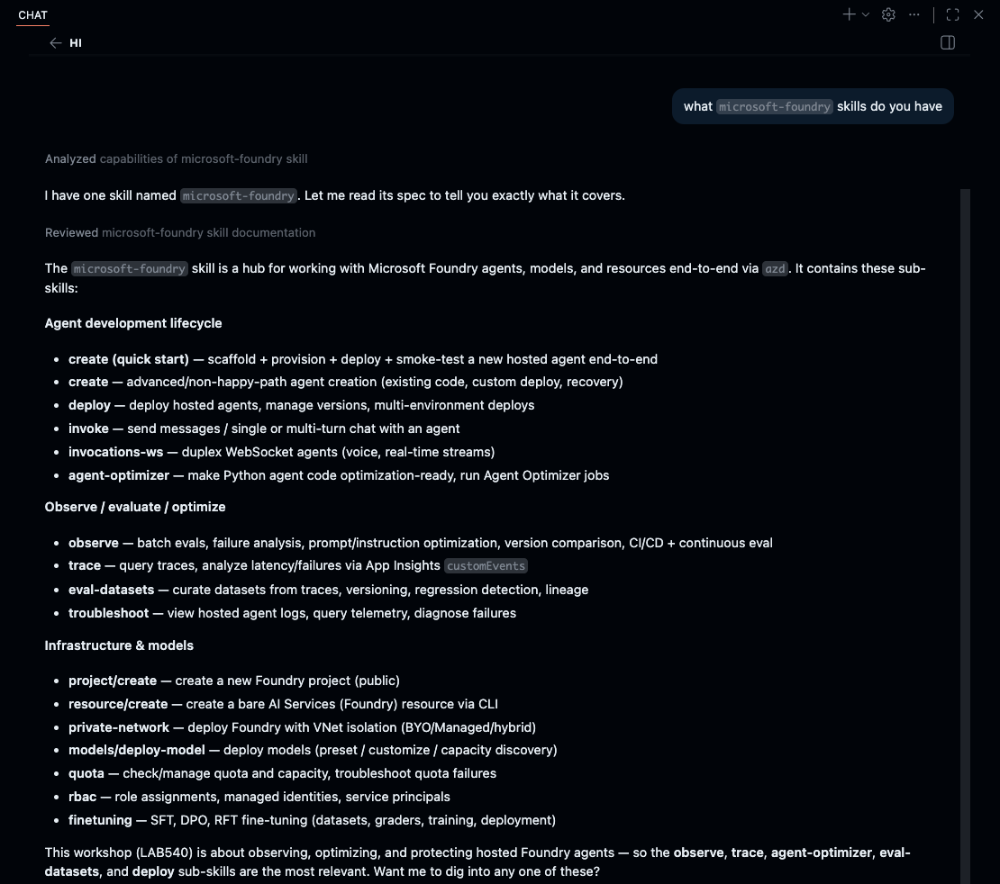

# Meet the Skill

Before you run it, take a moment to understand what the **Observe skill** does.

<!-- TODO screenshot: Copilot Chat explaining the microsoft-foundry observe skill -->

1. Check if Copilot has the required skills

   ```text
   What `microsoft-foundry` skills do you have?
   ```

2. Read the summary it gives you. It may look like this:

   

3. In this workshop, we'll focus on the `observe` skill. If time permits, you can use the same sandbox (deployed hosted agent) to explore other skills with GitHub Copilot.

> [!NOTE]
> The **`microsoft-foundry` Observe skill** automates the evaluation lifecycle
> for your hosted agent. In one workflow it:
>
> 1. **Generates** a test dataset tailored to your agent's capabilities.
> 2. **Evaluates** the deployed agent against that dataset with built-in
>    evaluators.
> 3. **Analyzes** the failures and patterns in the results.
> 4. **Recommends** specific optimizations to improve quality.

---

> ✅ **Success:** you understand what the Observe skill will do before you run it.

---

[← Prev: Activate Copilot](./03-optimize-03.md) &nbsp;•&nbsp; 🏠 [Contents](./README.md) &nbsp;•&nbsp; [Next: Run the Skill →](./03-optimize-05.md)
