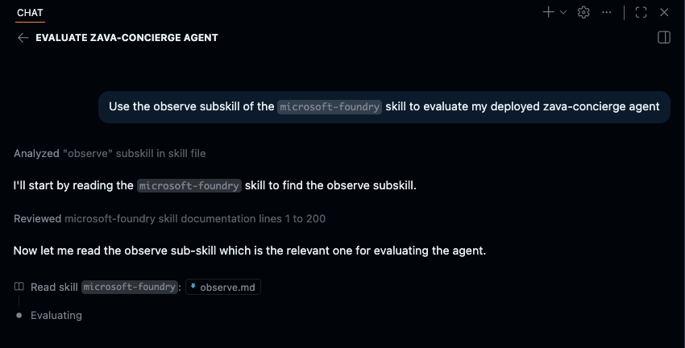

# Run the Skill

Now kick off the Observe skill and let it work.

<!-- TODO screenshot: Observe workflow starting in Copilot Chat (tool calls + files) -->

1. In Copilot Chat, send the activation prompt:

   ```text
   Use the observe subskill of the `microsoft-foundry` skill to evaluate my deployed zava-concierge agent
   ```

2. Confirm Copilot starts the Observe workflow. It should look something like this - _verify that it calls out the use of the microsoft-foundry skill_)

   


> [!NOTE]
> This kicks off a multi-step workflow. You don't need to do anything while it
> runs — you'll watch it work on the next page.

---

> ✅ **Success:** the Observe skill is running against your hosted agent.

---

[← Prev: Meet the Skill](./03-optimize-04.md) &nbsp;•&nbsp; 🏠 [Contents](./README.md) &nbsp;•&nbsp; [Next: Watch Baseline →](./03-optimize-06.md)
