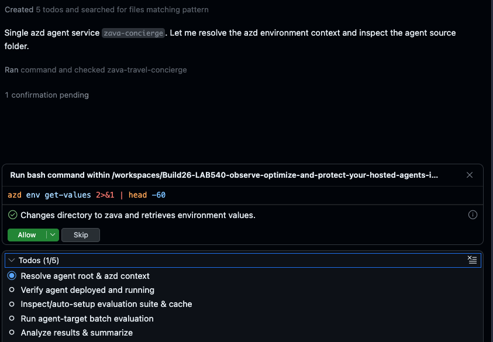

# Watch Baseline

Watch the Observe skill work. This is **code-first optimization** — the same
loop you saw in the portal, now driven from your editor.

As it runs, you'll see Copilot:

1. Create a **`.foundry`** folder with the generated evaluators and test dataset.
2. Run a **baseline evaluation** of your deployed agent against that dataset.
3. Produce a set of **recommendations** based on the failures it found.

## Sample Run

1. It creates a plan of action and start executing tasks to establish the baseline evaluation results for the existing deployment.

   

4. It may request permissions. Allow all for the session - _but verify you have Bypass approvals set_ to reduce recurrence (and speed up lab completion time)

> [!IMPORTANT]
> **Let it finish.** The baseline run and analysis take a few minutes. Watch the
> updates stream in and **wait until the recommendations appear** before moving
> on.

---

> ✅ **Success:** you saw code-first optimization — a baseline eval and recommendations.

---

[← Prev: Run the Skill](./03-optimize-05.md) &nbsp;•&nbsp; 🏠 [Contents](./README.md) &nbsp;•&nbsp; [Next: Pick Top Fix →](./03-optimize-07.md)
