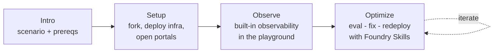

# LAB540 — Observe, Optimize and Protect Your Hosted Agents (Self-Guided)

This is the **self-guided** version of LAB540. Unlike the in-venue Skillable
lab — where the Azure infrastructure is pre-provisioned for you — here you'll
**provision everything yourself** in your own Azure subscription, then run the
same Observe and Optimize stages.

You'll see how the **Microsoft Foundry Observability** platform works with
**GitHub Copilot** and **Foundry Skills** to simplify the developer experience
and accelerate your progress from plan to prototype to production when building
and deploying **Hosted Agents**.

- **Duration:** 75–90 minutes (includes infrastructure deployment)
- **Level:** 200–300

---

## Travel Concierge

In this lab you'll take the **Zava Travel Concierge** — a multi-agent travel
planning system running as a hosted agent on **Microsoft Foundry** — from a
working prototype to a measurably better, production-quality agent.

You'll meet a travel desk staffed by four AI agents: three specialists that each
handle one part of a trip (**flights**, **hotels**, **car rentals**) and one
**concierge** that coordinates them. Your job is to make that team observable,
measurable, and better — using Foundry Skills and GitHub Copilot as your guide.

## What you'll need

- An **Azure subscription** with permission to create resources and access to
  **Microsoft Foundry** models in a supported region.
- A **GitHub account** (to fork the repo and run a Codespace).
- Familiarity with the terminal, `az`, and `azd` is helpful but not required.

## Workshop Outline

After a short **Intro**, the lab runs in three stages. Each builds on the last.

- **Setup** — fork the repo, launch a Codespace, deploy the infrastructure with
  `azd up`, and open the Azure and Foundry portals.
- **Observe** — explore the hosted agent in the playground and learn the
  built-in observability features (metrics, traces, evaluations).
- **Optimize** — run the eval → fix → redeploy agentic loop with Foundry Skills
  and GitHub Copilot.

Every step ends with a ✅ **success** so you know it worked before moving on, and
every stage closes with a recap of what you did and what comes next.

## Table of Contents

### Intro

| Page | What you'll do |
|------|----------------|
| [Get Started](./00-intro.md) | Meet the Zava Travel Concierge and learn the three stages |

> ✅ **Stage success:** you know what you'll build and the three stages ahead.

---

### Stage 1 — Setup

| Page | What you'll do |
|------|----------------|
| [Prerequisites](./01-setup-01.md) | Confirm your Azure subscription, GitHub account, and access |
| [Fork the Repo](./01-setup-02.md) | Fork the workshop repository to your account |
| [Launch Codespace](./01-setup-03.md) | Start a Codespace on your fork |
| [Sign in to Azure](./01-setup-04.md) | Authenticate `az` and `azd` |
| [Deploy Infrastructure](./01-setup-05.md) | Provision everything with `azd up` |
| [Azure Portal](./01-setup-06.md) | Open the portal and verify your resources |
| [Foundry Portal](./01-setup-07.md) | Open Foundry and enable New Foundry |

> ✅ **Stage success:** your infrastructure is deployed, the hosted agent is
> live, and the Azure and Foundry portals are open. Next, you'll explore
> observability.

---

### Stage 2 — Observe

| Page | What you'll do |
|------|----------------|
| [Open Playground](./02-observe-01.md) | View the agent in Foundry and open the Playground |
| [Set Up Metrics](./02-observe-02.md) | Turn on evaluators and get ready for your first prompt |
| [Run Prompt 1](./02-observe-03.md) | Send a prompt, view metrics, open traces with evaluations |
| [Run Prompt 2](./02-observe-04.md) | Send a prompt, open the conversation trace, learn about replays |
| [Run Prompt 3](./02-observe-05.md) | Send an out-of-scope prompt and see the agent instructions hold |

> ✅ **Stage success:** you've validated the infra and the hosted agent, and you
> understand Foundry's built-in observability. Next, you'll improve the agent
> from code.

---

### Stage 3 — Optimize

| Page | What you'll do |
|------|----------------|
| [Return to Codespace](./03-optimize-01.md) | Confirm `az`, `azd`, `python`; remove any stale `.foundry` |
| [Confirm Azure Sign-in](./03-optimize-02.md) | Verify `az` and `azd` are still authenticated |
| [Activate Copilot](./03-optimize-03.md) | Say hello, enable the Foundry MCP, set the model, bypass approvals |
| [Meet the Skill](./03-optimize-04.md) | Learn what the `microsoft-foundry` Observe skill does |
| [Run the Skill](./03-optimize-05.md) | Kick off the skill against your deployed agent |
| [Watch Baseline](./03-optimize-06.md) | See `.foundry` created, baseline eval complete, recommendations produced |
| [Pick Top Fix](./03-optimize-07.md) | Choose the leading recommendation to apply |
| [Optimize & Redeploy](./03-optimize-08.md) | Watch the agent get optimized and redeployed |

> ✅ **Stage success:** you've seen both code-first optimization and continuous
> optimization in action — one full eval → fix → redeploy loop with Foundry
> Skills.
