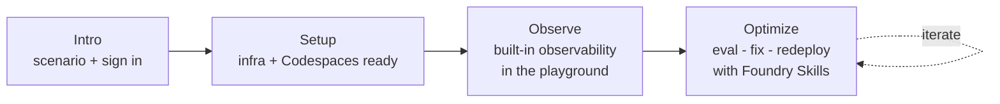

# LAB540 — Observe, Optimize and Protect Your Hosted Agents

In this hands-on lab, you'll see how the **Microsoft Foundry Observability**
platform works with **GitHub Copilot** and **Foundry Skills** to simplify the
developer experience and accelerate your progress from plan to prototype to
production when building and deploying **Hosted Agents**.

- **Duration:** 60 minutes
- **Level:** 200–300

---

## Travel Concierge 

In this hands-on lab you'll take the **Zava Travel
Concierge** — a multi-agent travel planning system running as a hosted agent on
**Microsoft Foundry** — from a working prototype to a measurably better,
production-quality agent.

You'll meet a travel desk staffed by four AI agents: three specialists that each
handle one part of a trip (**flights**, **hotels**, **car rentals**) and one
**concierge** that coordinates them. Your job is to make that team observable,
measurable, and better — using Foundry Skills and GitHub Copilot as your guide.

## Workshop Outline

After a short **Intro**, the lab runs in three stages. Each builds on the last.

- **Setup** — get the infrastructure and your Codespace ready to go.
- **Observe** — explore the hosted agent in the playground and learn the
  built-in observability features (metrics, traces, evaluations).
- **Optimize** — run the eval → fix → redeploy agentic loop with Foundry Skills
  and GitHub Copilot.

Every step ends with a ✅ **success** so you know it worked before moving on, and
every stage closes with a recap of what you did and what comes next.

## Table of Contents

### Intro

| Page | What you'll do |
|------|----------------|
| [Get Started](./00-intro.md) | Meet the Zava Travel Concierge and learn the three stages |

> ✅ **Stage success:** you know what you'll build and the three stages ahead.

---

### Stage 1 — Setup

| Page | What you'll do |
|------|----------------|
| [Open Edge](./01-setup-01.md) | Sign in to the lab VM and launch the browser |
| [Azure Portal](./01-setup-02.md) | Sign in to the Azure portal |
| [Foundry Portal](./01-setup-03.md) | Sign in to Foundry and enable New Foundry |
| [Launch Codespace](./01-setup-04.md) | Sign in to GitHub and start your Codespace |

> ✅ **Stage success:** three browser tabs are open and your Codespace is
> launching. While it builds, you'll explore observability in the next stage.

---

### Stage 2 — Observe

> Your Codespace takes a few minutes to build — use that time to explore the
> hosted agent and Foundry's built-in observability.

| Page | What you'll do |
|------|----------------|
| [Open Playground](./02-observe-01.md) | View the agent in Foundry and open the Playground |
| [Set Up Metrics](./02-observe-02.md) | Turn on evaluators and get ready for your first prompt |
| [Run Prompt 1](./02-observe-03.md) | Send a prompt, view metrics, open traces with evaluations |
| [Run Prompt 2](./02-observe-04.md) | Send a prompt, open the conversation trace, learn about replays |
| [Run Prompt 3](./02-observe-05.md) | Send an out-of-scope prompt and see the agent instructions hold |

> ✅ **Stage success:** you've validated the infra and the hosted agent, and you
> understand Foundry's built-in observability. Next, you'll improve the agent
> from code.

---

### Stage 3 — Optimize

| Page | What you'll do |
|------|----------------|
| [Open Codespace](./03-optimize-01.md) | Confirm `az`, `azd`, `python`; remove any stale `.foundry` |
| [Sign in to Azure](./03-optimize-02.md) | Authenticate `az` and `azd` with a device code |
| [Activate Copilot](./03-optimize-03.md) | Say hello, enable the Foundry MCP, set the model, bypass approvals |
| [Meet the Skill](./03-optimize-04.md) | Learn what the `microsoft-foundry` Observe skill does |
| [Run the Skill](./03-optimize-05.md) | Kick off the skill _(prompt to be finalized)_ |
| [Watch Baseline](./03-optimize-06.md) | See `.foundry` created, baseline eval complete, recommendations produced |
| [Pick Top Fix](./03-optimize-07.md) | Choose the leading recommendation to apply |
| [Optimize & Redeploy](./03-optimize-08.md) | Watch the agent get optimized and redeployed |

> ✅ **Stage success:** you've seen both code-first optimization and continuous
> optimization in action — one full eval → fix → redeploy loop with Foundry
> Skills.
